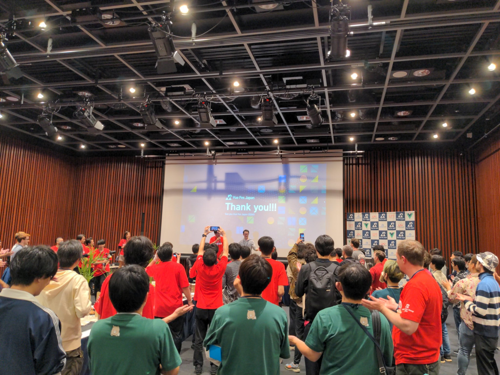

VueFes Japan 2023 に LT 登壇 & ボランティアスタッフ参加をしたのでその振り返り。

## LT 登壇

Vue.js で作る GridSystem に関する LT を行なった。
スライドは「[Vue.js を使って Grid System を実装した話](https://speakerdeck.com/t0yohei/vue-woshi-tute-grid-system-woshi-zhuang-sitahua)」に。

この LT 登壇、実はタイトル詐欺でした。

当初は業務で実装した Vue.js の GridSystem はこんな感じでした的な話をする予定だったけど、それじゃあんまり面白くないなーと思い話の方向性を変えることに。

GridSystem 自体を実際に作る人がそんなにいないだろうから、それを作った話をしても観客的に微妙かもってところと、発表する本人としてもただやったことを話すだけだとなんか面白みに欠けるなと。

ということで登壇一週間前に、思い切って Vue で GridSystem を作るライブコーディングをしてみようと方向転換。

タイトルも **「Vue.js を使って Grid System を実装した話」** から **「Vue.js で作る Grid System」** へ(ホームページに掲載しているタイトルなどはそのままだけど、スライド内で勝手に変更する感じにした)。

builderscon 2019 での DQNEO さんによる「[コンパイラをつくってみよう](https://speakerdeck.com/dqneo/how-to-make-a-compiler)」のライブコーディングが、観客として見ていてとてもエキサイティングだったのが今でも頭に刻み込まれており、そういう感じの発表ができたらいいなと思った次第。

結果から言うと、ライブコーディングの挑戦自体は良かったものの、練習不足と尺都合の関係から満足が行く出来にはならずと言う感じだった。
実際にコーディングするのではなく、カンペコードを用意してそれをコピー&ペーストするというくらいまでしかできなかったし、時間に追われてコードの紹介や説明も中途半端になり上手く実演できずだった。

結構面白かったよと言ってくれた方もいたけど、期待して見に来てくれていた方がいたら申し訳ない出来だったのかなと感じる。
悔しいのでまたどこかでリベンジしよう(同じ内容の話を 10 分尺とかでリベンジしたい気もする)。

ちなみに、LT 登壇にて話しきれなかった Vue で作る GridSystem の詳細な話は、下記のブログでまとめてみた。

https://engineer.crowdworks.jp/entry/2023/10/28/114403

実際に Vue で GridSystem を作る人がいたら、何かの参考になるかなと。
多くの人に向けたセッションと、実際に参考にしたいって人に向けたブログを分けたのは個人的には良い取り組みじゃないかなと言う気がしてる。

## ボランティアスタッフ参加

今回は、人生で初めてカンファレンスのボランティアスタッフとしても参加した。イベントの根幹から考えていくコアスタッフではなく、イベント当日などだけ参加する一日スタッフ的なやつ。

動機としては大したものはなく、せっかくの機会だしまあやってみるかという具合。LT 登壇もあったりして余裕的に大丈夫かなと言う懸念もあったけど、まあなんとかなるやろの精神(他のも 5 人ほど登壇者かつスタッフをやっている人がいた)。

他のスタッフの人と話す機会がたくさんあり、Vue 界隈の知り合いが以前の何倍も増えた気がする。まあ元が少なかっただけではあるが。

LT 登壇とのスタッフ業の両立は...できてなくはないけど、ちゃんとできた訳ではないという感じだった。↑の LT 登壇のところでも話した通り、やっぱり練習の時間を確保するのが個人的には難しくそれが痛かった。

前日の夜も作業があり、帰宅するのが夜遅くになったことと、当日も朝早く会場に着いている必要があったりで、発表練習の時間があんまり取れなかった。睡眠時間を削れば前日の夜に練習できたけど、当日のパフォーマンスにも響くので断念した。

この点は、前日準備をお休みさせてもらったら何とかなったか...？　って気がしなくもないけど、イベント当日に向けた打ち合わせもあるので中々難しいところ...。カンファレンスで登壇とスタッフ参加を上手く両立させている人はどのような工夫をしているんだろう？　両立できてそうな人を見かけたら今度聞いてみよう。

来年のスタッフ参加をどうするかは今の所未定。ボランティアスタッフはまたやらせてもらうかも...？　来年のその時が来たらまた考えよう。

## 他のセッションについて

スタッフ業をやっていたため他のセッションはほとんど見られなかったけど、シフトが入っていない時間などで見に行ったセッションで面白かったものをいくつか。

(Evan の話も聞けなかったのは残念だった...。録画が公開されたらちゃんと見よ)

### Vue.js クリニック

Evan など、Vue.js のエキスパートに色々質問して答えてもらうセッション。いやー、めちゃくちゃ面白かった。

ref と reactive のどちらを使うのがいいかと言った質問に対し、

> 「reactive の書き味は OptionsAPI とも似ているので当初は推していたが、ユーザーが ref に慣れてきた今となっては ref をオススメしたい。」

https://x.com/punksy2/status/1718174713955090610?s=20

のように答えたりなど、普段どういうことを考えながら言語デザインを行なっているのかが垣間見えてとても面白かった。

自分が考えた質問も実際に答えてもらったりして、とても有意義なセッションだった。

垂れ流していた感想などは ↓ に。

- https://x.com/t0yohei/status/1718173910523580731?s=20
- https://x.com/t0yohei/status/1718175673968402919?s=20
- https://x.com/t0yohei/status/1718179369372270862?s=20
- https://x.com/t0yohei/status/1718181672288686431?s=20

### パネルディスカッション

途中参加にはなってしまったけどとても興味深い話が聞けた。

パネラーの方の中に最近は React を使っている方もいたりで、自分の中でも他の言語と比べて Vue はどうだろうって考える機会にもなりとても良かった。

Vue・React・Svelte・Angular などのフレームワークにおける、できること・できないことはほとんど違いがなくて、どうやるかが主な違いになっていると感じている。(↑ の Vue.js クリニックのセッションで Evan も同じようなことを言っていた)

数年前まで Vue をもてはやしていたのに、世の中の人は勝手なことを言うよなーと感じることもあるが、コミュニティの力とかも関連していそうで難しいところ。
そういう意味でも Vue3 の重いマイグレーションに伴うコミュニティの分断っていうのは痛かったよなあって気がしてる(それに対して自分が何か大きく貢献したかって言うとそうではないので、ただのぼやき)。

そういうことも含め個人的に一家言あったりもしたけど、Vue について深く考えることができたセッションでした。登壇者の皆様お疲れ様でした。ありがとうございました。

垂れ流していた感想などは ↓ に。

- https://x.com/t0yohei/status/1718162397968638337?s=20
- https://x.com/t0yohei/status/1718163509236965608?s=20
- https://x.com/t0yohei/status/1718163855598346491?s=20

## 来年の VueFes について

今回の VueFes が盛況に終わったということもあり、アフターパーティの最後でかずぽんさんから告知があったように、VueFes 2024 開催予定とのこと。
(下記の写真のスライド中央にも、うっすらと「See you Vue Fes Japan 2024!!!」の文字が見える)。

来年も話せそうなネタがあったら、CFP 出してみよう。

終わり。
